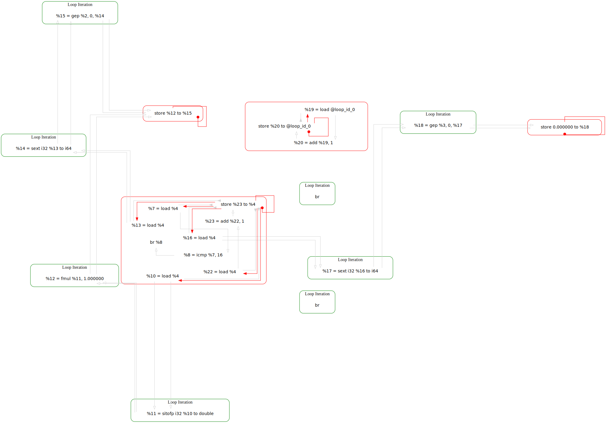
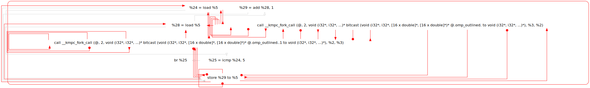
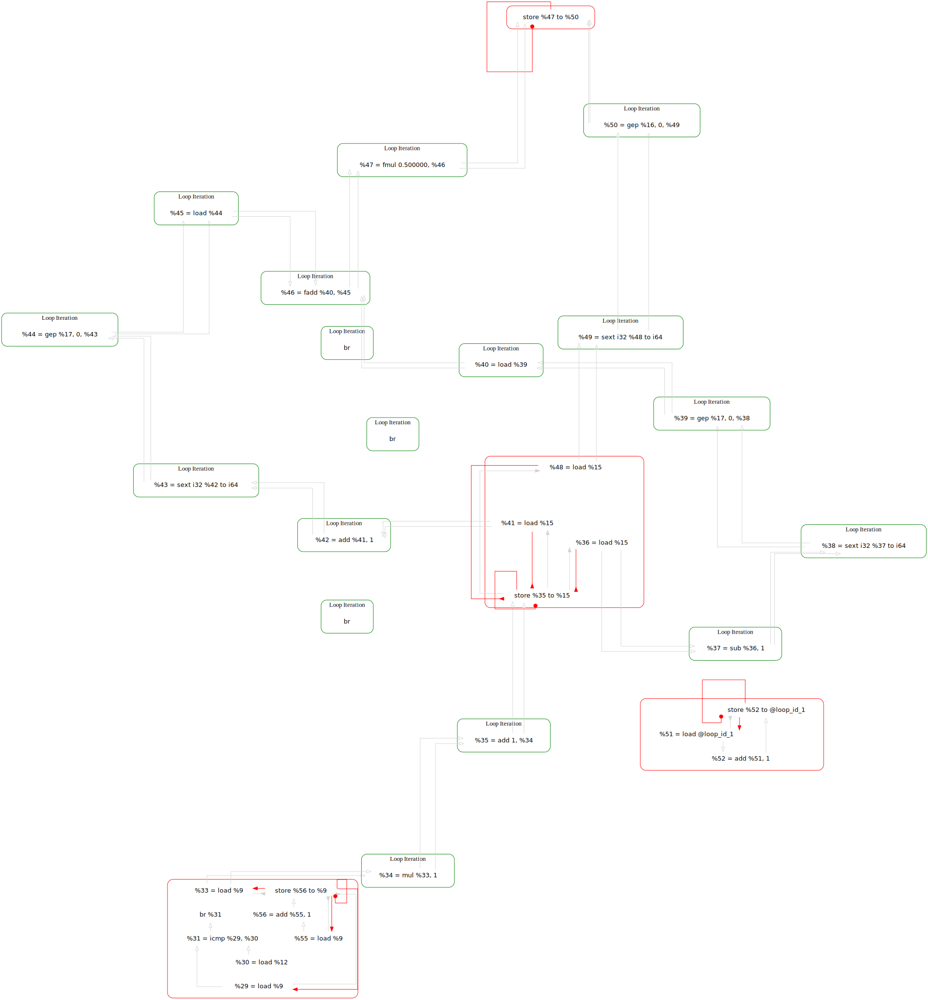
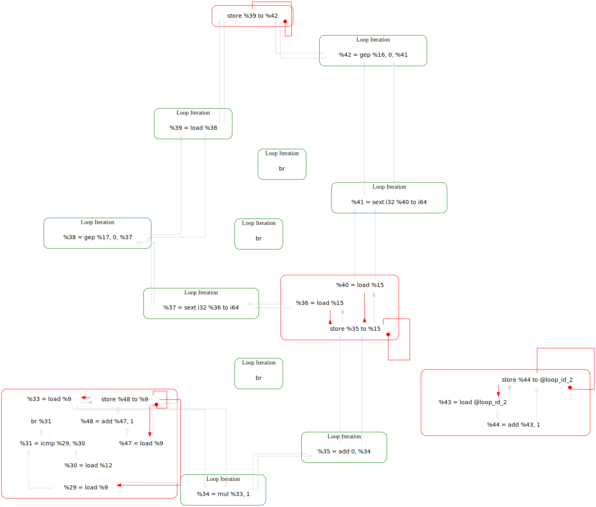

```cpp
#include <stdio.h>
#include <omp.h>
#define N 16
#define ITER 5

volatile int loop_id_0 = 0;
volatile int loop_id_1 = 0;
volatile int loop_id_2 = 0;
volatile int loop_id_3 = 0;

int main() {
    double a[N], b[N];

    for (int i = 0; i < N; i++) {
        a[i] = i * 1.0;
        b[i] = 0.0;
        loop_id_0 += 1;
    }

    for (int t = 0; t < ITER; t++) {
        #pragma omp parallel
        for (int i = 1; i < N - 1; i++) {
            b[i] = 0.5 * (a[i - 1] + a[i + 1]);
            loop_id_1 += 1;
        }

        #pragma omp parallel
        for (int i = 0; i < N; i++) {
            a[i] = b[i];
            loop_id_2 += 1;
        }
        loop_id_3 += 1;
    }
    return 0;
}
```

---

```cpp
for (int i = 0; i < N; i++) {
	a[i] = i * 1.0;
	b[i] = 0.0;
	loop_id_0 += 1;
}
```



We can ignore the SCC containing instructions for `@loop_id_0` as this is purely to identify the loop_id for 
```bash
noelle-ldg-dot program.bc --ldg-dot-loop-id=0
```
as the graph only works on a per loop basis that is found in the normalised bitcode.

The focus will be on the largest unknown SCC as that contains the majority of work, in this loop there is a mix of computation and loop bookkeeping.

%16 is the base address of the `b` array which is then cast to `i64` and then using the `gep` instruction at the offset

---

```cpp
for (int t = 0; t < ITER; t++) {
	#pragma omp parallel
	for (int i = 1; i < N - 1; i++) {
		b[i] = 0.5 * (a[i - 1] + a[i + 1]);
		loop_id_1 += 1;
	}

	#pragma omp parallel
	for (int i = 0; i < N; i++) {
		a[i] = b[i];
		loop_id_2 += 1;
	}
	loop_id_3 += 1;
}
```


---
```cpp
for (int i = 1; i < N - 1; i++) {
	b[i] = 0.5 * (a[i - 1] + a[i + 1]);
	loop_id_1 += 1;
}
```



---

```c++
for (int i = 0; i < N; i++) {
	a[i] = b[i];
	loop_id_2 += 1;
}
```
